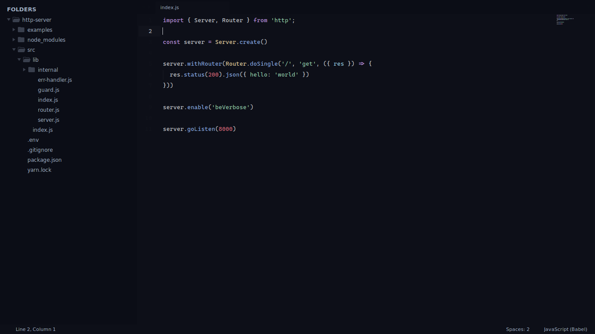

# Decay Sublime Text

A port of decay for sublime text.



## Installation

To install the sublime text port, follow the next steps:

1. Clone the repo

```sh
git clone --depth=1 https://github.com/decaycs/decay-sublime-text
cd decay-sublime-text
```

2. Install the theme

```sh
test -d ~/.config/sublime-text/Packages || mkdir -p ~/.config/sublime-text/Packages
cp -r ./src/Colorsublime-Themes ~/.config/sublime-text/Packages
cp -r ./src/User/* ~/.config/sublime-text/User/
```

3. Apply the theme

Open the command palette inside sublime text (`Ctrl+Shift+P`) and type: `UI: Select Color Scheme` and select your favorite decay variant, then open the command palette again and type: `UI: Select Theme` and (again), select your favorite decay variant.

## Gallery


## Enjoy

That's all! Enjoy with it :)